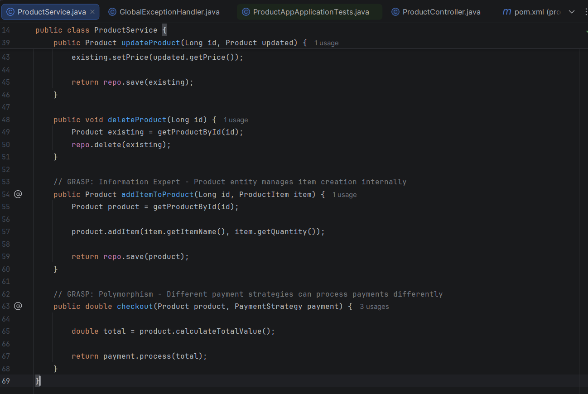
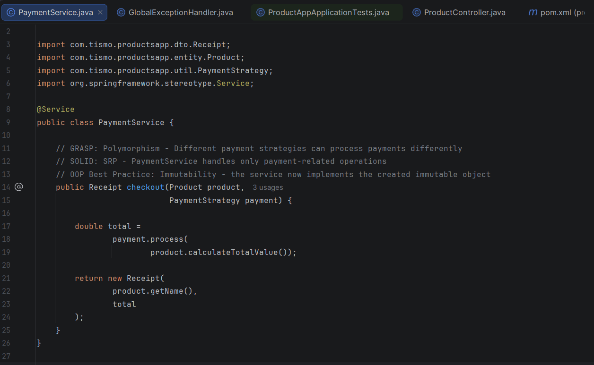
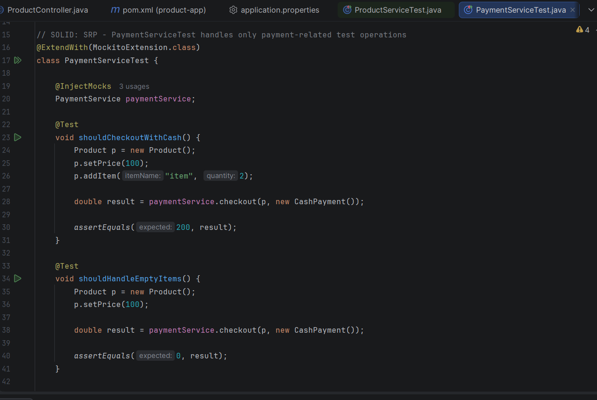
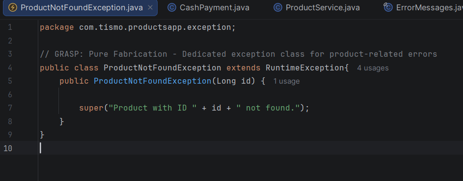
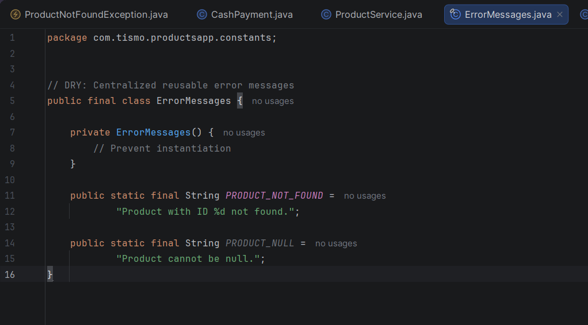
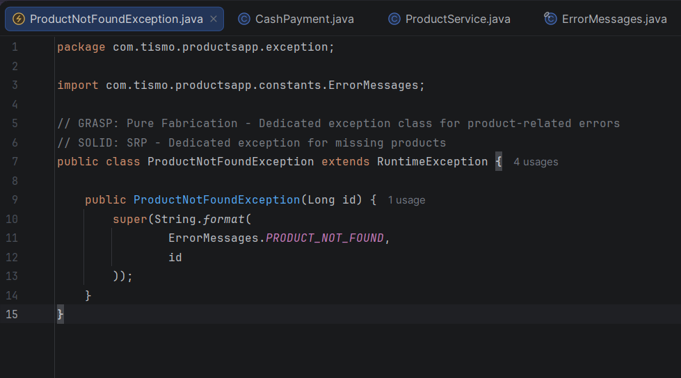
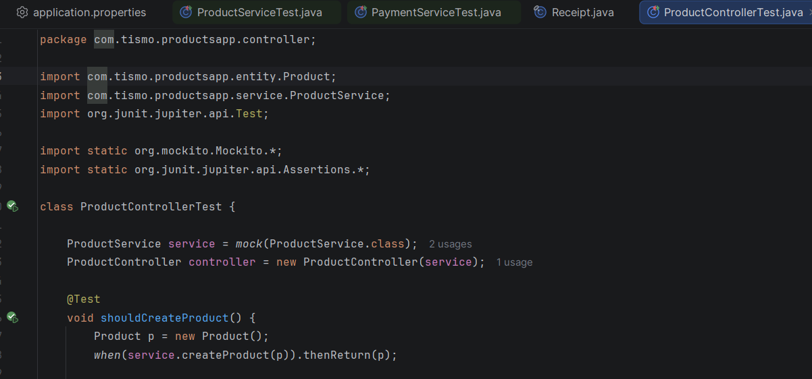
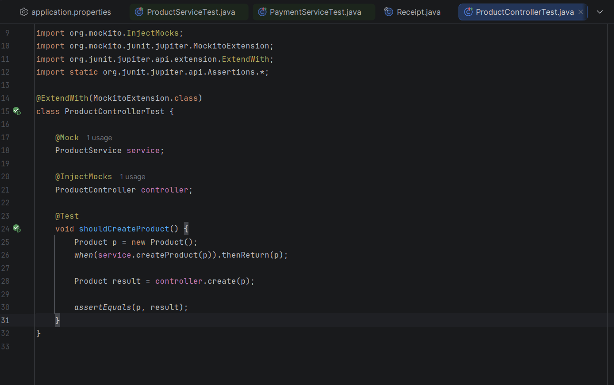
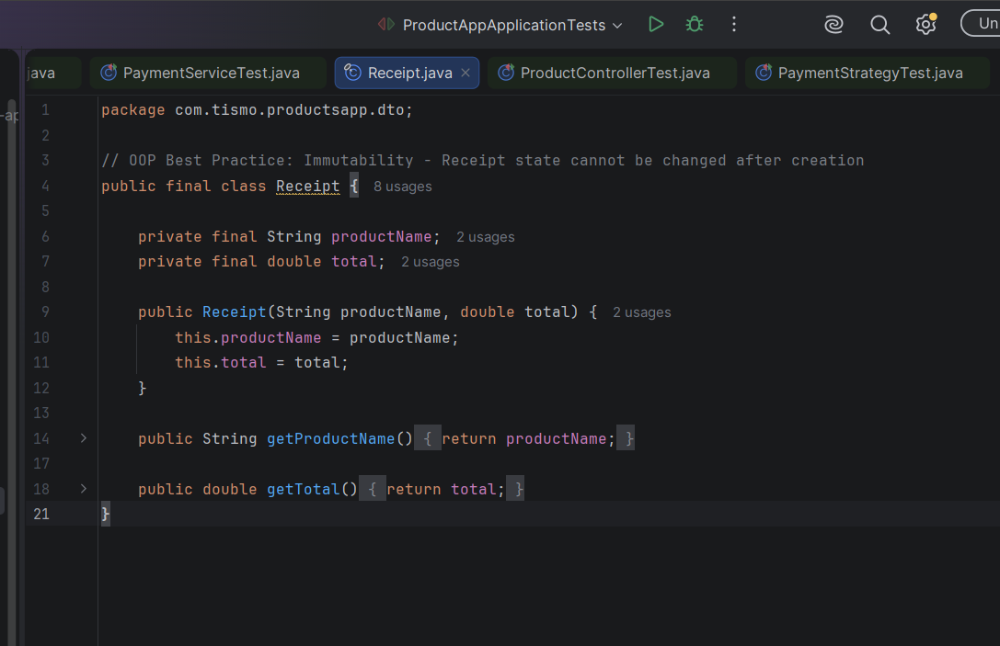

## Before

ProductService handles {createProduct(), getAllProducts(), updateProduct(), deleteProduct(), and checkout()} but checkout is a different responsibilty

therefore it violated the SRP SOLID principle

## After

created PaymentService which handles the payment-related operations

## Before

Exception messages are hardcoded.

## After

created ErrorMessage constant

now it follows DRY principle - Reusable error message constants

## Before

manually creating mocks

## After

a cleaner and more professional usage of mockito

## Before

no immutable object

## After

created receipt which cannot be modified

more features were added specially unit testings
