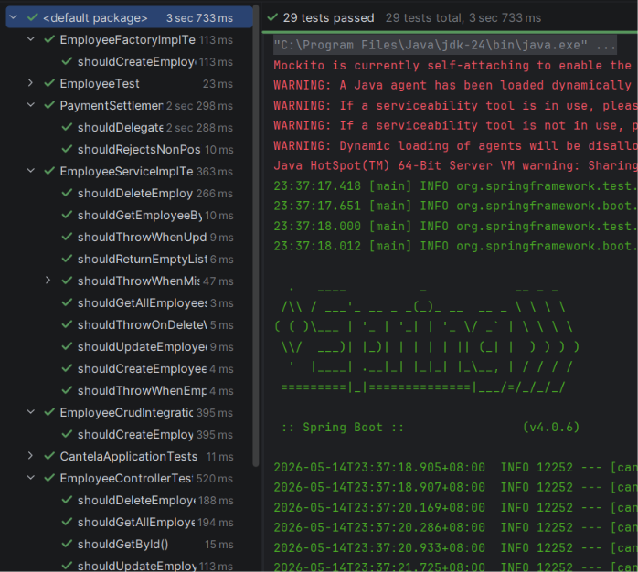
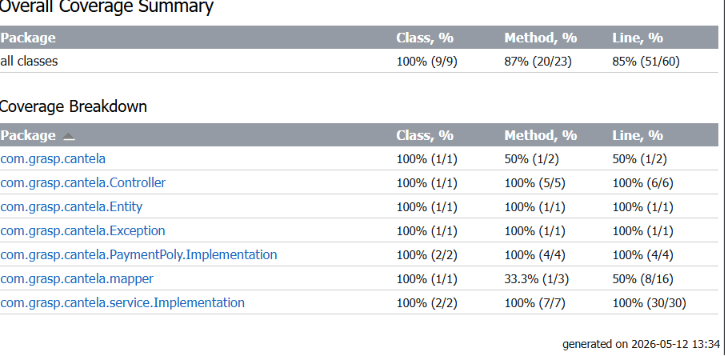
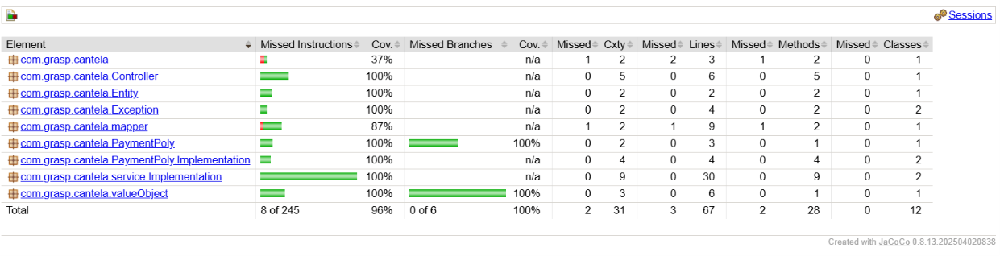
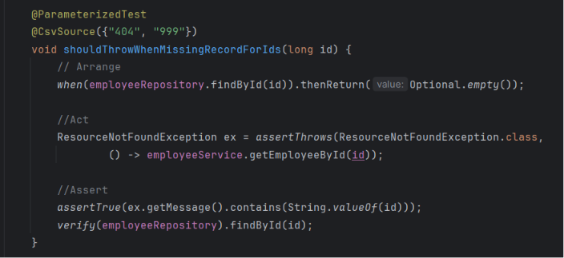
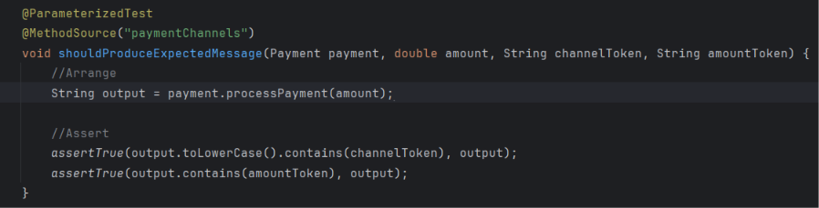
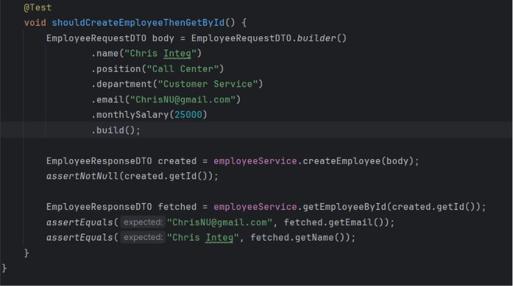
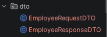
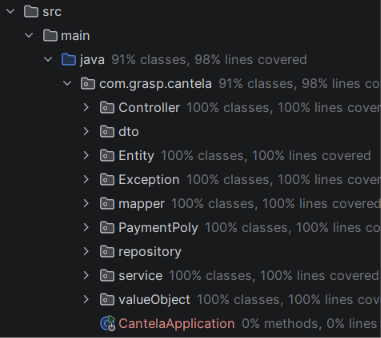

# NOTE: THE COMMENTS IN THIS FOLDER ARE DONE BY AI TO DOCUMENT
## Minimum and Bonus are all met.

# Screenshots Unit Tests
### There are a total of 29 test, all of them passed

# Red-Green-Blue cycle
### See the video to see the cycle in action. Found in Refactoring-evidence.

# Intellij Coverage

# Jacoco Coverage

# BONUS
- Parameterized test: FOUND IN EmployeeServiceImplTest

Found in PaymentImplementationTest

- Integration Test: found in EmployeeCrudIntegrationTest

- DTO PATTERN: EmployeeRequest and EmployeeResponseDTO

- Custom Exception: ResourceNotFound and NegativeAmountException

- Better Package Organization: Package for Entity, DTO, Controller, Service, Exception, Mapper, PaymentPoly, Repository, Service, ValueObject

# Review and Retrospect

- Which principle improved your design the most? DRY principle, because it helped me to  remove the duplicate codes. (see the details in Before and After md, in refactoring evidence folder)

- What bad design did you remove? well again I removed the duplicate code in employee service, and I also removed the overlapping responsibility between EmployeeMapper and EmployeeFactory.

- Which principle was hardest to apply? YAGNI, for me because I always think ahead resulting to adding uncessary code, that's why it took me long time to pass the previous activity (GRASP) because I was adding code that is not needed for the current requirement, and had to remove it later on.