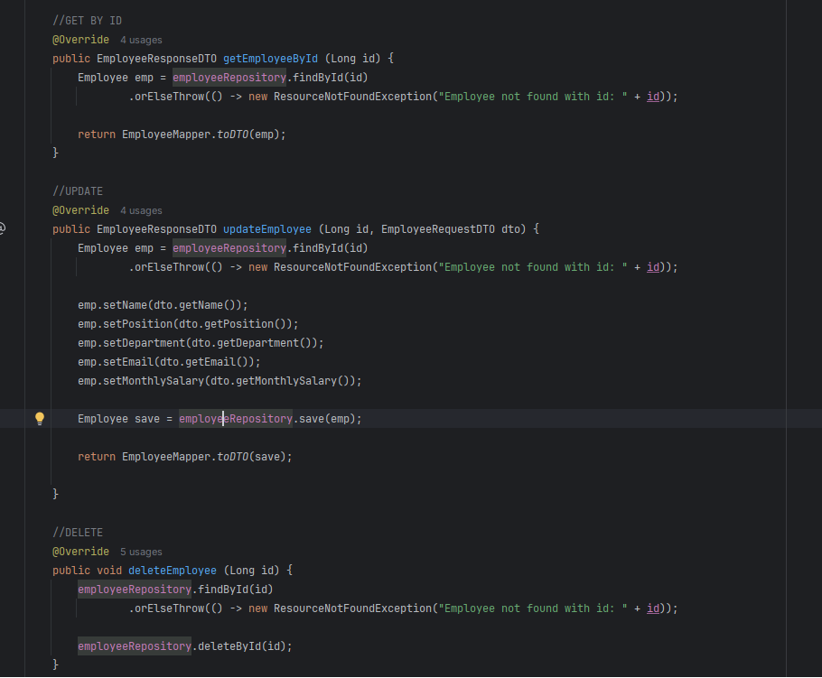
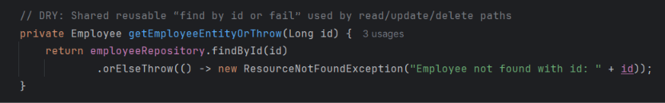
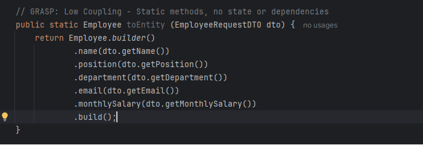
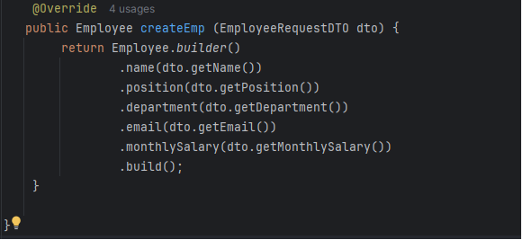
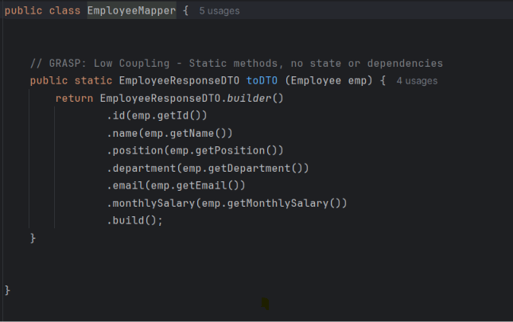

# Before / after: `EmployeeServiceImpl` lookup handling

## Before

Three separate calls for findById else throw an exception, Same pattern

violated the DRY principle

## After

A single private helper centralizes lookup and error semantics:

public methods can call this helper, and do their own behavior. Basically it helps reusability.

# Before / After: 'EmployeeMapper & EmployeeFactoryImpl'

## Before
A toEntity method in the EmployeeMapper that has no usage, and has same functionality with createEmp in EmployeeFactory, which follows the CREATE GRASP PRINCIPLE
#### Employee Maper

#### Employee Factory

## After
Now the EmployeeMapper is only responsible for mapping Entity to DTO, and the EmployeeFactory is responsible for creating EmployeeEntity from DTO, which follows the Single Responsibility Principle
#### Employee Mapper

#### Employee Factory still has the same integration as before, but the createEmp method is now the only method responsible for creating EmployeeEntity from DTO